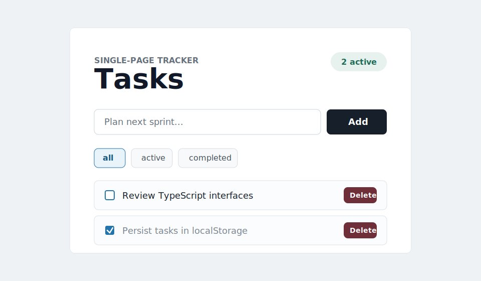

# Task Tracker

A clean single-page task tracker built with React, Vite, and strict TypeScript.



## Demo

Run the app locally and open it in your browser:

```bash
npm install
npm run dev
```

Vite will print a local URL, usually:

```text
http://127.0.0.1:5173/
```

## Features

- Add tasks
- Mark tasks as completed
- Delete tasks
- Filter by all, active, and completed
- Persist tasks with `localStorage`

## How to use

1. Type a task into the input.
2. Select **Add** to create it.
3. Check a task to mark it completed.
4. Use **all**, **active**, and **completed** to filter the list.
5. Select **Delete** to remove a task.

Tasks are saved in your browser with `localStorage`, so they remain after refreshing the page.

## Scripts

```bash
npm install
npm run dev
npm run build
```

## Tech stack

- React
- Vite
- TypeScript
- Browser `localStorage`
